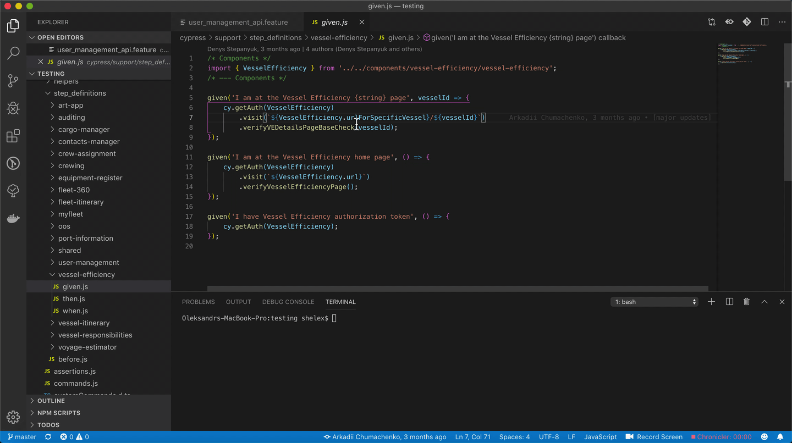
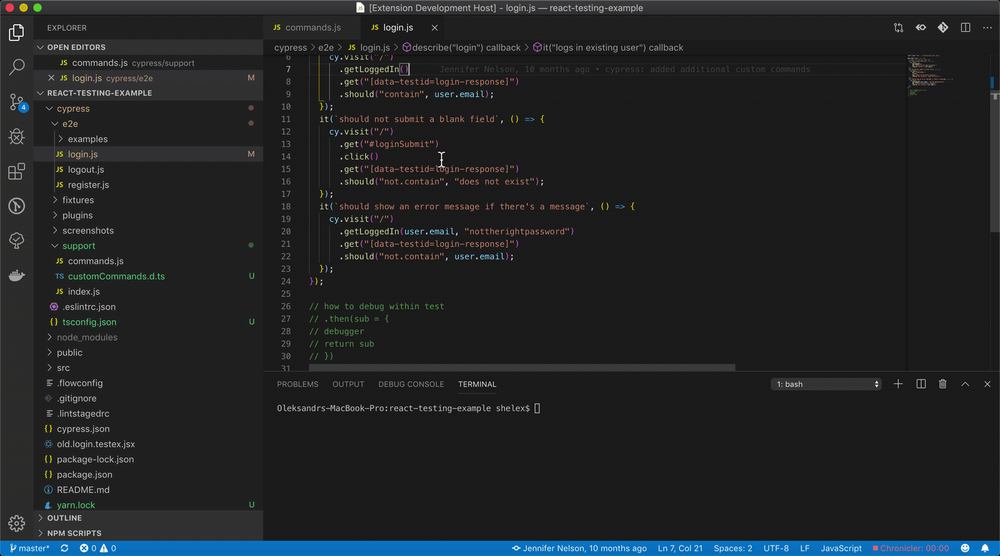
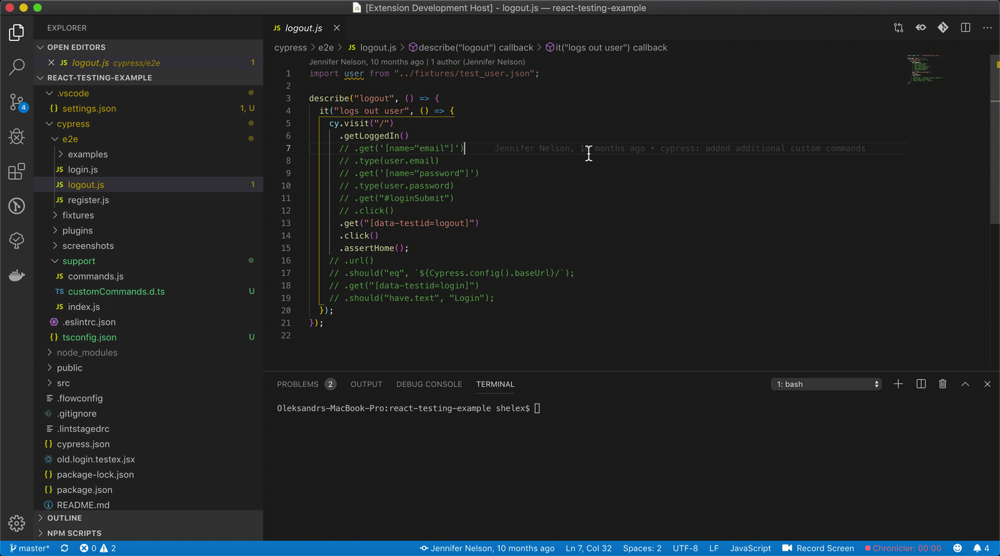
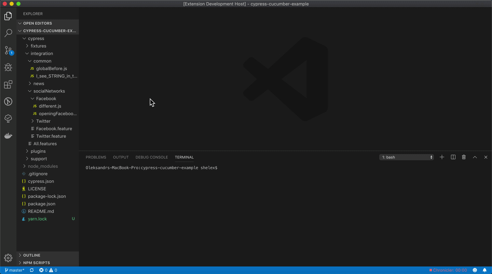
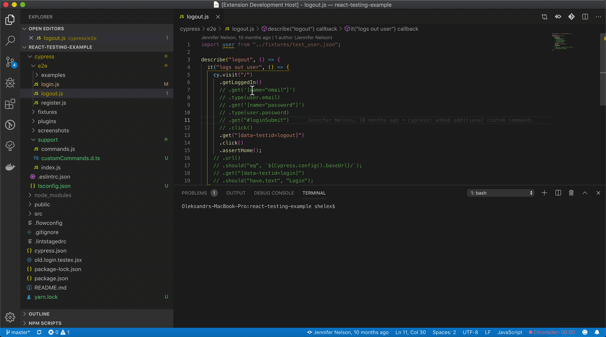
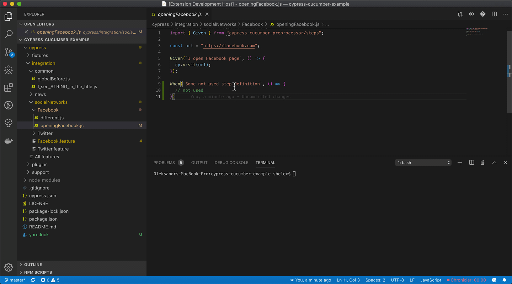
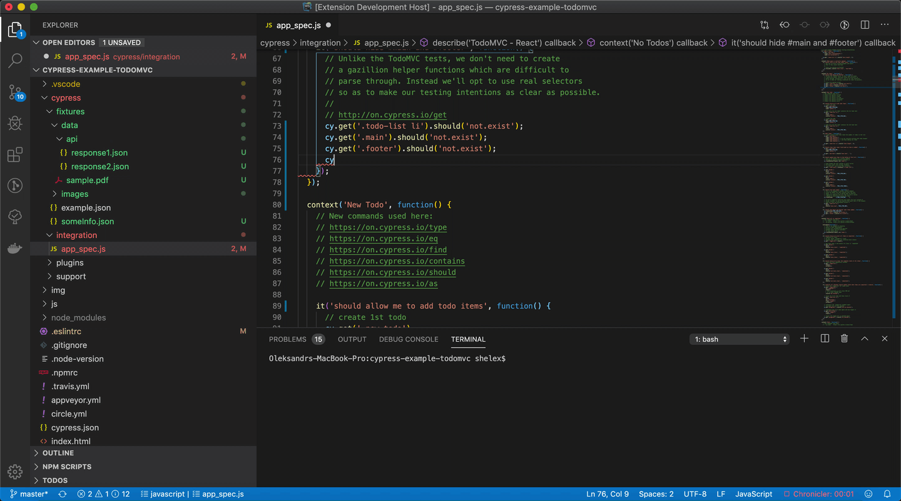

# vscode-cy-helper
Cypress extension for vs code  

  

## Configuration

| setting                              | description                           | default           |    
|:--------------------------------------|:---------------------------------------|:-------------------|        
| `cypressHelper.commandForOpen`       | command used for opening cypress      | `cypress open`    |    
| `cypressHelper.customCommandsFolder` | path to folder with custom commands   | `cypress/support` |    
| `cypressHelper.typeDefinitionFile` | file to save generated custom commands   | `cypress/support/customCommands.d.ts`|    
| `cypressHelper.typeDefinitionExcludePatterns` | array of glob patterns that should be excluded from types generation  | [`**/*.ts`] |
| `cypressHelper.includeAnnotationForCommands` | include comments before custom command to type definition file | false |    
| `cypressHelper.menuItems` | display menu items for commands |  `{ ` `"OpenSingleTest": true,`  `"OpenSpecFile": true,`  `"GenerateCustomCommandTypes": true,` `"GoToCustomCommand": true,`  `"FindCustomCommandReferences": true,` `"FindStepDefinitionReferences": true` `}` |    

## Available commands or menu items
* [Go to cypress custom command definition](#1-open-cypress-custom-command-definition)
* [Open Cypress](#2-open-cypress-window)
* [Generate type definition for custom commands](#3-generate-type-definitions-for-cypress-custom-commands)
* [Find not used custom commands](#4-find-not-used-cypress-custom-commands)
* [Find not used cucumber step definitions](#5-find-not-used-cucumber-step-definitions)
* [Find custom command references](#6-find-cypress-custom-commands-references)
* [Find cucumber step references](#7-find-cucumber-step-definition-references)
* [Fixture autocompletion](#8-fixtures-autocompletion)

## Usage
### 1. Open cypress custom command definition
Click on cypress custom command, and from menu select `Cypress: Go to custom command definition`

### 2. Open Cypress window
* for opening file - select in menu `Cypress: Open spec file`  
* for marking some tests with `only` tags - select in menu `Cypress: Open single test`  
Tags will be deleted after closing terminal instance

### 3. Generate type definitions for Cypress custom commands
From menu select `Cypress: Generate custom command types`

### 4. Find unused Cypress custom commands
From command palette select command `Cypress: Find not used custom commands`  

### 5. Find unused Cucumber step definitions
From command palette select command `Cypress: Find not used Cucumber step definitions`  

### 6. Find Cypress custom commands references
From menu select `Cypress: Get custom command references`

### 7. Find Cucumber step definition references
From menu select `Cypress: Get step definition references`

### 8. Fixtures autocompletion
Typing `cy.fixture(` opens VS Code Completion interface with possible files and subfolders  
to select needed fixture file  
thanks to [Josef Biehler](https://github.com/gabbersepp/cypress-fixture-intellisense) for original fixture autocomplete idea
  

## License

Copyright 2019 90poe.  This project is licensed under the Apache 2.0 License.  