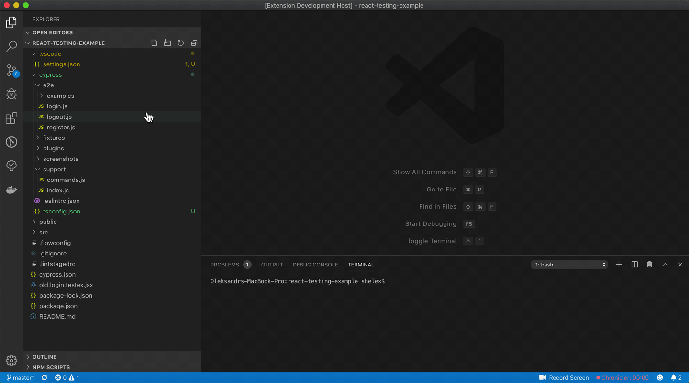

# vscode-cy-helper
Cypress extension for vs code  
## Installation
* Download file `vscode-cy-helper-{version}.vsix` from this repository
* Open VS Code extensions menu
* In up right corner with 3 dots menu find option `install from VSIX`
* Select file downloaded vsix file  

## Configuration
in `.vscode/settings.json`:    

| setting                              | description                           | default           |    
|:--------------------------------------|:---------------------------------------|:-------------------|    
| `cypressHelper.packageManager`       | package manager to use - npm/yarn/npx | `yarn`            |    
| `cypressHelper.commandForOpen`       | command used for opening cypress      | `cypress open`    |    
| `cypressHelper.customCommandsFolder` | path to folder with custom commands   | `cypress/support` |    
| `cypressHelper.typeDefinitionFile` | Specify file to save generated custom commands file   | `cypress/support/customCommands.d.ts`|    
| `cypressHelper.typeDefinitionExcludePatterns` | Specify strings should be not included in file paths while looking for commands  | `.d.ts` |    

## Usage
### Open cypress custom command definition
In a spec file or step definition (in case of cucumber) select name of target command, 
and from menu select `Go to Custom Command Definition`

### Open Cypress window
* for opening file - select in menu `Open Cypress Spec File`
* for marking some tests with `only` tags - select in menu `Open Cypress Single Spec`

### Generate type definitions for Cypress custom commands
From menu select `Genarate Cypress Custom Command types`

