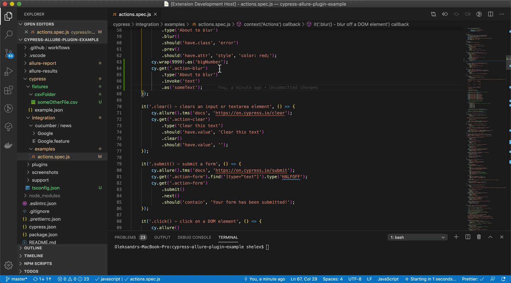

# vscode-cy-helper
Cypress extension for vs code  

  

## Available functionality
### Custom commands
* [Go to definition](#1-open-cypress-custom-command-definition)
* [References](#2-find-cypress-custom-commands-references)
* [Find unused commands](#3-find-not-used-cypress-custom-commands)
* [Generate type definitions file for custom commands](#4-generate-type-definitions-for-cypress-custom-commands)
### Step definitions (cucumber)
* [References](#5-find-cucumber-step-definition-references)
* [Find unused steps](#6-find-not-used-cucumber-step-definitions)
### Other
* [Open cypress window](#7-open-cypress-window)
* [Fixture path autocompletion](#8-fixtures-autocompletion)
* [Fixture path go to definition](#9-fixtures-definition)
* [Alias autocompletion](#10-alias-autocompletion)
* [Alias go to definition](#11-alias-definition)
* [Cucumber tags autocompletion](#12-cucumber-tag-autocompletion)
* [Create default tsconfig file](#13-create-default-tsconfig-file)

## Configuration

| setting                              | description                           | default           |    
|:--------------------------------------|:---------------------------------------|:-------------------|        
| `cypressHelper.commandForOpen`       | command used for opening cypress      | `cypress open`    |    
| `cypressHelper.customCommandsFolder` | path to folder with custom commands   | `cypress/support` |    
| `cypressHelper.typeDefinitionFile` | file to save generated custom commands   | `cypress/support/customCommands.d.ts`|    
| `cypressHelper.typeDefinitionExcludePatterns` | array of glob patterns that should be excluded from types generation  | [`**/*.ts`] |
| `cypressHelper.includeAnnotationForCommands` | include comments before custom command to type definition file | false |    
| `cypressHelper.typeDefinitionOnSave` | generate type definitions file for custom commands on save | false |    
| `cypressHelper.menuItems` | display menu items for commands |  `{ ` `"GenerateCustomCommandTypes": true,` `"GoToCustomCommand": true,`  `"FindCustomCommandReferences": true,` `"FindStepDefinitionReferences": true` `}` |    
| `cypressHelper.fixtureAutocompletionCommands` | cypress commands that accept fixture path as argument to add fixture path autocompletion | `["fixture"]` |   
| `cypressHelper.cucumberFixtureAutocompleteOnQuotes` | If you want fixture autocompletion in cucumber scenarios (using fixtures as parameters) you can enable it by setting `true` | false |   
| `cypressHelper.enableCommandReferenceProvider` | In case you have type definitions, native Find all References will return duplicates for commands. To avoid it set this parameter to `false` | true |   
| `cypressHelper.cucumberTagsAutocomplete` | Set `enable: true` for cucumber feature autocomplete on `@`. Array of tags could be specified. Option to add [cypress-allure-plugin](https://www.npmjs.com/package/@shelex/cypress-allure-plugin) tags.  | `{` `"enable": false,` `"tags": ["focus"],` `"allurePlugin": false` `}` |   
| `cypressHelper.reuseTerminalInstance` | By default executes `commandForOpen` in same terminal instance. To spawn new instance for each cypress opening set it to `false` | true | 

## Usage
### 1. Open cypress custom command definition
In case you want to be instantly redirected to definition file - click on custom command, and from editor menu select `Cypress: Go to custom command definition`  
You can use native `Go to Definition` and `Peek Definition` - but usually it offers several results, so you should pick one by yourself.  
If you are using just native editor menu items - you can disable `Cypress: Go to custom command definition` in configuration `cypressHelper.menuItems` by setting `"GoToCustomCommand": false`  
How it works:  
- Text from current line with cursor is taken, trying to find closest command call in line;
- Checking files in `cypressHelper.customCommandsFolder` (`cypress/support` by default).
- In case file with `Cypress.Commands.add(%%detected_command%%)` is found - redirect.

### 2. Find Cypress custom commands references
From editor menu select `Cypress: Get custom command references` to choose from quick-pick menu or you can use native `Find All References` and `Peek References` to use left-panel tab.  
You can disable editor `Cypress: Get custom command references` item with configuration `cypressHelper.menuItems` and `"FindCustomCommandReferences": false`.  
In case you have custom command `.ts` definition file in your workspace - native methods will return duplicated results, so you can turn off extension references provider with configuration `cypressHelper.enableCommandReferenceProvider: false`.  

### 3. Find unused Cypress custom commands
From command palette (⌘P) select `Cypress: Find not used custom commands`  

### 4. Generate type definitions for Cypress custom commands
Context menu item `Cypress: Generate custom command types` or can also be configured to generate types on save, with `cypressHelper.typeDefinitionOnSave`  
How it works:
- checks configuration `customCommandsFolder`, `typeDefinitionFile`, `typeDefinitionExcludePatterns`, `includeAnnotationForCommands`  
- get files from `customCommandsFolder`, excepting `typeDefinitionExcludePatterns`  
- in case custom command definitions found - trying to parse argument types, setting `any` by default  
- get `typeDefinitionFile` content to check how much commands changed to display message
- check for command names duplication (2 commands with same name will cause inappropriate behaviour)
- write file with type definitions for commands to `typeDefinitionFile`, in case `includeAnnotationForCommands: true` also includes comment above commands. __Please note__ that comment should be in [JSDoc](https://code.visualstudio.com/docs/languages/javascript#_jsdoc-support) format (`/**`), in other case only last comment is added.    
- in case workspace has no `tsconfig.json` file, prompt to create it will be shown.
- show message about duplicates, added and deleted commands.

### 5. Find Cucumber step definition references
From menu select `Cypress: Get step definition references` to choose from quick-pick menu or you can use native `Find All References` and `Peek References` to use left-panel tab.  

### 6. Find unused Cucumber step definitions
From command palette select command `Cypress: Find not used Cucumber step definitions`  

### 7. Open Cypress window
* For opening Cypress with current file - click CodeLens "Open Cypress" (button above test). 
Please note that it will execute command from `cypressHelper.commandForOpen` configuration.
* For marking some tests with `only`/`@focus` tag, or removing - click corresponding CodeLens. Also, you can just close terminal `CypressOpen` to remove all `only` tags from your file.  
* In case this functionality is not needed for your case, it could be disabled by setting configuration `cypressHelper.menuItems.OpenCypress` to `false`  
#### How it works:   
- get `cypressHelper.commandForOpen`;
- open terminal with name `CypressOpen`;
- send command `%%commandForOpen%% --config testFiles=%%spec%%` to terminal, where `%%spec%%` is opened test file path;  
- after terminal `CypressOpen` is closed - deletes from opened test file all `@focus` or `.only` tags;  

### 8. Fixtures autocompletion
Typing `cy.fixture(` opens VS Code Completion interface with possible files and subfolders to select needed fixture file  
To add your own commands that require fixture autocomplete for arguments - check configuration `cypressHelper.fixtureAutocompletionCommands`  
If you are using cucumber and fixtures as parameters in your scenarios, you can enable autocomplete by setting `cypressHelper.cucumberFixtureAutocompleteOnQuotes: true`  
Thanks to [Josef Biehler](https://github.com/gabbersepp/cypress-fixture-intellisense) for original fixture autocomplete idea  
  

### 9. Fixtures definition
Go to definition and Peek definition options for feature files.  
Works in cucumber feature files in scenario or examples table also.  
Currently default fixtures path `cypress/fixtures` supported only.  

### 10. Alias autocompletion

Autocompletion for aliases. Aliases will be selected from files in current folder.

### 11. Alias definition

Go to definition and Peek definition options available for aliases.  
Aliases created in same folder files are supported only.  

### 12 Cucumber tags autocompletion
Typing `@` in `.feature` file shows autocompletion with tags from configuration `cypressHelper.cucumberTagsAutocomplete.tags` - with `focus` by default. In case you have [cypress-allure-plugin](https://www.npmjs.com/package/@shelex/cypress-allure-plugin) just set `cypressHelper.cucumberTagsAutocomplete.allurePlugin` and list of allure tags will be available.

### 13. Create default tsconfig file
From command palette select command `Cypress: Create default tsconfig.json file`  

tsconfig could also be created when `Cypress: Generate custom command types` is used. 

## License

Copyright 2019 90poe.  This project is licensed under the Apache 2.0 License.  