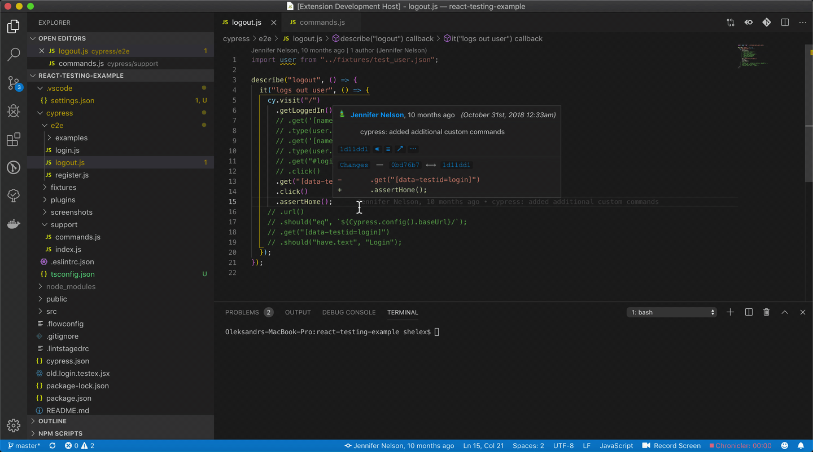

# vscode-cy-helper
Cypress extension for vs code  
## Installation
* Download file `vscode-cy-helper-{version}.vsix` from this repository
* Open VS Code extensions menu
* In up right corner with 3 dots menu find option `install from VSIX`
* Select file downloaded vsix file  

## Configuration

| setting                              | description                           | default           |    
|:--------------------------------------|:---------------------------------------|:-------------------|        
| `cypressHelper.commandForOpen`       | command used for opening cypress      | `cypress open`    |    
| `cypressHelper.customCommandsFolder` | path to folder with custom commands   | `cypress/support` |    
| `cypressHelper.typeDefinitionFile` | Specify file to save generated custom commands file   | `cypress/support/customCommands.d.ts`|    
| `cypressHelper.typeDefinitionExcludePatterns` | Specify array of glob path patterns that should be excluded from types generation  | [`**/*.ts`] |    

## Usage
### 1. Open cypress custom command definition
In a spec file or step definition (in case of cucumber) select name of target command, 
and from menu select `Cypress: Go to custom command definition`

### 2. Open Cypress window
* for opening file - select in menu `Cypress: Open spec file`  
* for marking some tests with `only` tags - select in menu `Cypress: Open single test`  
Tags will be deleted when closing terminal

### 3. Generate type definitions for Cypress custom commands
From menu select `Cypress: Generate custom command types`

### 4. Find not used Cypress custom commands
From command palette select command `Cypress: Find not used custom commands`  
After item selection - source file with command will be opened.  

### 5. Find not used Cucumber step definitions
With using Cypress cucumber preprocessor it is difficult  
to define which steps are not used and are legacy
From command palette select command `Cypress: Find not used Cucumber step definitions`  
After item selection source file with step definition will be opened.  

